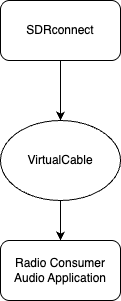
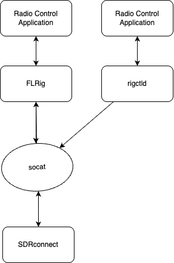

# sdrconnect-helper
Setup instructions and scripts to setup Sdrplay SdrConnect environment for ham radio

## Definitions
* Ham Radio Digital Applications
  * flrig
  * fldigi
  * wsjt-x
  * freeDV
  * js8call
  * gridtracker

* Virtual Audio - Path and components used to pass digital audio from a source to a destination.

* Virtual Comm Port - Path and components used to pass digital data bi-directional between two applications.

* SoCat - Application used to bi-directionally pass data from one exposed /dev/ttysXXX device to another /dev/ttysYYY.
* SDRconnect - Application from SDRplay used to control the RSPx SD hardware.
* flrig - Application used to convert FLrig messages sent over the network to into a radio specific command.  In this use case, the SDRconnect message set is the same as the Kenwood TS-2000.

## Installation
* [this repository on github](https://github.com/kb7ky/sdrconnect-helper.git)
* [Virtual Cable](https://vb-audio.com/Cable/index.htm?gad_source=1&gad_campaignid=11369121960&gbraid=0AAAAADjKyE76t54EMrwPJNkmV0spKGOqM&gclid=Cj0KCQjw8c3VBhCsARIsAA_xJ91npopAZNu8eLQgLqXgs9Dfv8zNTvqqZEX-y-7LXETb_Sr0rH5pgbQaAjyqEALw_wcB)
* flrig
  <https://www.w1hkj.org>
* fldigi
  <https://www.w1hkj.org>
* [wsjt-x](https://wsjtx.github.io/wsjtx/index.html)
* [freeDV](https://freedv.org/download/)
* [js8call](https://js8call.com/downloads.html)
* [gridtracker](https://gridtracker.org/index.php/downloads/gridtracker-downloads)

## Virtual Audio

## Virtual Comm Port

## Startup Procedure
### Core SDRconnect, VirtualComPort, RigCtld, FLRig
* open Terminal and run runSDR.sh
  * Take note of SDRCATPORT and RIGCTLPORT.  These are required later...

#### First time config
* SDRconnect will be started by runSDR.sh
  * do not click to start SDR
  * under Tool(Wrench), select Rig Control
  * make sure CAT Emulator is ON
  * make sure baud rate is 57600
  * set COM Port via pulldown to the SDRCATPORT value
  * Now you can click Green Arrow to start SDR

* open Launcher and Start flrig
  * if SDRCATPORT has changed, this will wait on initialization and you must kill the process and redo the config.
    * kill preferences
      * rm -rf ~/.flrig
    * Start flrig
      * Config -> Setup -> Ttansceiver
        * Radio TS-2000
        * baud rate 57600
        * You must enter the device port (RIGCTLPORT)... ex /var/tmp/ttySDRCOMPORT
        * click init
        * if this fails try init again
  * check that SDRconnect and flrig have the same frequency

#### Subsequent Startup
* click Green Arrow to start SDR
* open Launcher and Start flrig

### WSJT-X
wsjt-x is a program that implements most of the Joe Taylor et al radio modem protocols.  Popular ones are FT8, WSPR (called Whisper).

* dependencies
  * SDRconnect running
  * flrig running
  * VB-Cable setup as audio output of SDRconnect
* open Launcher and Start wsjt-x

#### First time config
* WSJT-X -> Preferences -> Radio
  * set rig to FLRig FLRig
  * click Test Cat - should go green

* back to SDRconnect
  * While SDR is running, turn on sidebar
  * set mode to USB and filter to 3k if not already set
  * scroll down to audio - open panel
    * select VB-Cable[Core Audio] for the device
    * make sure noise reduction is OFF

* back to wsjt-x
  * WSJT-X -> Preferences -> Audio
    * set input to VB-Cable and close preferences
    * You should see audio activity on the right bar
    * if audio is high or low, set it in SDRconnect with the volume slider
  * WSJT-X -> Preferences -> Reporting
    * set UDP Server = 127.0.0.1
    * set IDP server port number = 22392
    * click Accept UDP Request
    * close preferences

* open Launcher and Start GridTracker
  * watch for wsjt-x messages in the top right box

### freeDV

* dependencies
  * SDRconnect running
  * rigctld running
  * VB-Cable setup as audio output of SDRconnect

* open Launcher and Start freeDV
* Select the frequency/Band you wish to listen
* Click Start Modem
* watch for audio level on the left side of the interface
* wait.... not a great amount of activity
* Top Menu Window -> FreeDV reporter

#### First time config
  * click the main window to show the tool menu pulldown
  * select CAT and PTT config
    * click Enable CAT control via Hamlib
    * click Apply
    * test PTT.  If no error pops up, then it worked..... :-(
  * select Audio Config...
    * this config is kind of confusing, but has a lot of power....
    * Receive Tab (at bottom of selection boxes)
      * Input To Computer from Radio
        * set to VB-CABLE
      * Output from Computer to Speaker/Headphones
        * Set to system output (speakers or headphones)
    * Transmit Tab
      * set both to None
    * Apply and OK

### JS8Call
JS8Call is a communication protocol utilizing much of the work done by Joe Taylor et al with FT8.  Key differences are the design of a flexible test payload (so you can chat with others) and a messaging scheme that allows for posting messages and pinging other network nodes.  This mode "should" be very popular, but for some reason is not so much.  Great stuff as it is the communication mode of chatting, with the weak signal performance near FT-8.

As this started out as a fork of wsjt-x, much of the interface and configuration is similar.  As time has gone on, there has been some divergence from wsjt-x and js8call.

That being said, the configuration process is very similar to wsjt-x.

* dependencies
  * SDRconnect running
  * flrig running
  * VB-Cable setup as audio output of SDRconnect
* open Launcher and Start JS8Call

#### First time config
* JS8Call -> Preferences -> Radio
  * set rig to FLRig FLRig
  * click Test Cat - should go green

* back to SDRconnect
  * While SDR is running, turn on sidebar
  * set mode to USB and filter to 3k if not already set
  * scroll down to audio - open panel
    * select VB-Cable[Core Audio] for the device
    * make sure noise reduction is OFF

* back to JS8Call
  * JS8Call -> Preferences -> Audio
    * set input to VB-Cable and close preferences
    * You should see audio activity on the right bar
    * if audio is high or low, set it in SDRconnect with the volume slider
